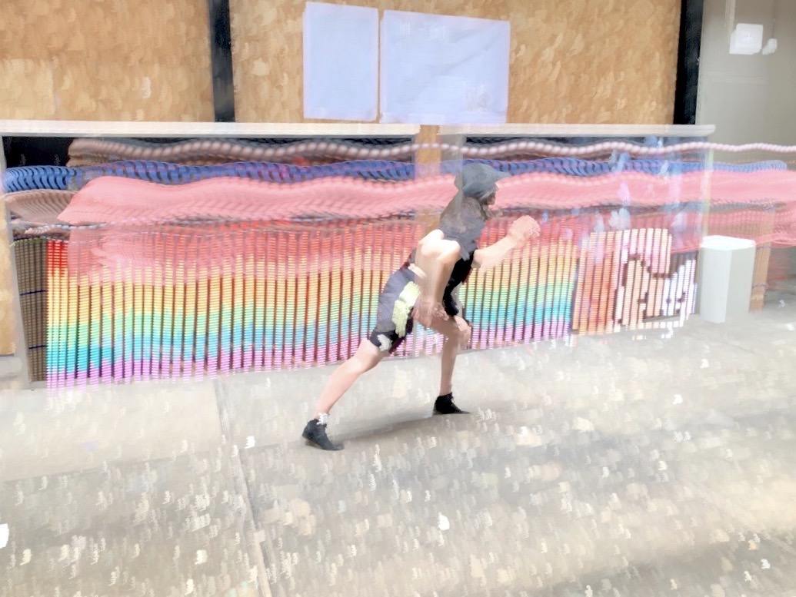
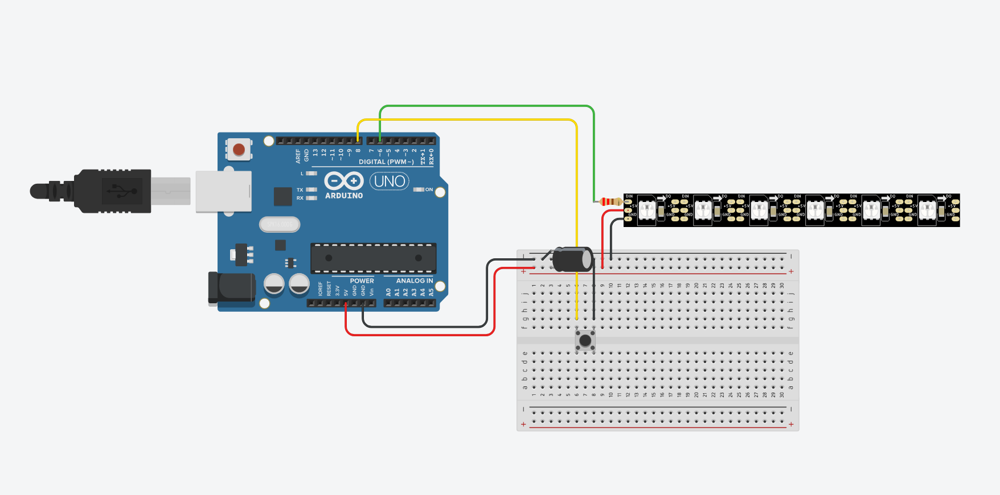

# KittenLed

Arduino & WS2812 based lightpainting. 	

KittenLed was hacked together during the "[The Body Electric: Wearables!](https://hackersanddesigners.nl/s/Summer_Academy_2019/p/The_Body_Electric%3A_Wearables%21)" workshop at the Hackers & Designers summer academy 2019. It has two parts:
- A Processing sketch that converts a color image to arrays of RGB values.
- An arduino sketch for displaying the RGB values row by row on a strip of WS2812 pixels.

## Getting Started

You need an Arduino, a strip of WS2812 pixels and a color image where the height equals the number of pixels of your strip. 

### Installation

Install the [Arduino IDE](arduino.cc), the [Fastled](http://fastled.io/) library and [Processing](processing.org/).
Connect the data line of the leds to pin 6 of the Arduino. Power as per the [Adafruit uberguide](https://learn.adafruit.com/adafruit-neopixel-uberguide/powering-neopixels). Add a button between pin 8 and ground.

## Usage

- Resize your image so that the height in pixels is equal to the number of pixels on your strip.
- Add your image to the `/data` directory of the Processing sketch and adjust line 5 to represent your filename.
- Run the Processing sketch: your RGB data will be saved to `kitten.txt`. Copy the content of this file.
- Open the Arduino sketch.
- Paste the RGB values to the top of the sketch, and if necessary, comment/remove older ones.
- Upload the code to the Arduino.
- Press the button to start lightpainting.

## Acknowledgments

* https://github.com/CharStiles
* https://github.com/Heerko
